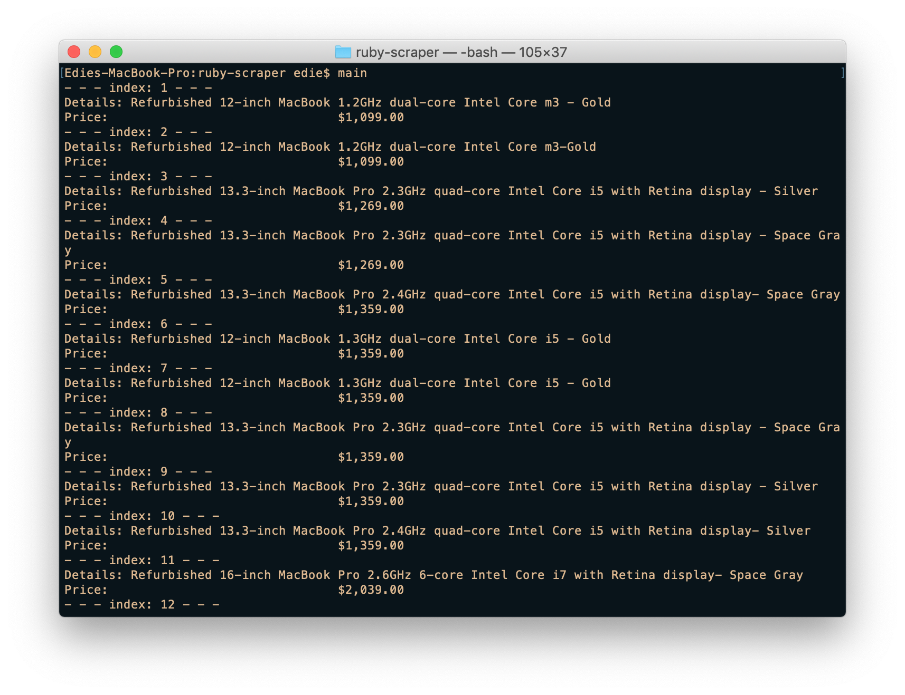

# My ruby-scraper
Web scraper using nokogiri gem. This script returns information from https://www.apple.com/shop/refurbished/mac about 
available refurbished mac computers and there prices for anyone looking to buy one. 




## To run the program:
### 1 - Install dependencies:
- In your terminal go to the folder you have saved the repository and type:

```$ bundle install ```

### 2 - Open folder that with saved repository
### 3 - Open bin folder and type:
```$ main```

## Testing with RSpec:
* Open terminal on the folder you saved and type:
 
```$ rspec```

## Built With
- Ruby
# Author

👤 **Edie Atha**

- Github: [@edieatha](https://github.com/edieatha)
- Twitter: [@edieatha](https://twitter.com/edieatha)
- Linkedin: [linkedin](https://www.linkedin.com/in/edieatha/)
 Email: [email](edieatha@gmail.com)

## 🤝 Contributing

Contributions, issues and feature requests are welcome!

Feel free to check the [issues page](https://github.com/edieatha/enumerable-methods/issues).

## Show your support

Give a ⭐️ if you like this project!

## Acknowledgments

* [Microverse](https://www.microverse.org/)
* [The Odin Project](https://www.theodinproject.com/)


## 📝 License

This project is [MIT](lic.url) licensed.